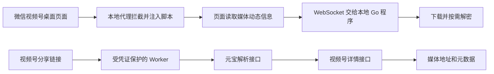

# `wx_channels_download` 实现原理

查阅日期：2026-09-29。本文依据上游仓库 [`ltaoo/wx_channels_download`](https://github.com/ltaoo/wx_channels_download) 的源码和项目文档，解释与视频号内容获取有关的两条路径。分享链接路径的字段、错误和凭证细节另见[解析实现调查](wx-channels-upstream.md)。上游使用的视频号及元宝 Web 接口并非稳定的公开接口，以下描述是当前实现，不保证长期有效。

## 总览

两条路径解决的是同一个前置问题：取得媒体动态的可用媒体地址及必要元数据。桌面路径借助用户正在浏览的微信页面；分享链接路径借助元宝 Web 登录态和视频号详情接口。取得媒体信息后的下载处理可以复用，但两条路径的认证条件不同。[项目使用说明](https://github.com/ltaoo/wx_channels_download/blob/main/README.md)、[分享链接 Worker](https://github.com/ltaoo/wx_channels_download/blob/main/internal/workers/sph/worker.js)

## 路径一：桌面页面与本地代理

1. **接入页面流量**：程序运行本地 HTTP 代理。默认使用系统代理，也支持配置 TUN 或与 Clash 协同；为了修改 HTTPS 页面响应，首次使用需安装受信任的根证书。这会影响设备的网络代理和证书信任设置。[代理配置](https://ltaoo.github.io/wx_channels_download/config/proxy.html)、[证书说明](https://ltaoo.github.io/wx_channels_download/guide/certificate.html)
2. **注入页面逻辑**：代理对 `channels.weixin.qq.com` 的 HTML 响应插入脚本，按首页、详情、直播等页面加载不同逻辑；还会处理部分 `res.wx.qq.com` 的 JavaScript 响应。注入脚本提供下载按钮并读取页面已取得的视频号数据。[拦截器](https://github.com/ltaoo/wx_channels_download/blob/main/pkg/scraper/wxchannels/interceptor.go)、[详情页脚本](https://github.com/ltaoo/wx_channels_download/blob/main/pkg/scraper/wxchannels/inject/channels.feed.js)
3. **交给本地程序**：注入的页面脚本通过 WebSocket 与本地 Go 程序连接，交换页面信息和 API 调用结果；本地程序再创建下载任务。[页面 WebSocket 实现](https://github.com/ltaoo/wx_channels_download/blob/main/pkg/scraper/wxchannels/inject/channels.ws.js)
4. **下载与按需解密**：部分媒体需要用取到的密钥和加密区间解密。源码以 ISAAC64 生成密钥流，仅对加密区间做 XOR；流式读取器按偏移调整密钥流位置，使 HTTP Range 请求也能正确播放或下载。`encLimit=0` 时读取器直接透传。[ISAAC64 实现](https://github.com/ltaoo/wx_channels_download/blob/main/pkg/scraper/wxchannels/decrypt.go)、[流式读取器](https://github.com/ltaoo/wx_channels_download/blob/main/pkg/scraper/wxchannels/reader.go)、[下载与解密处理](https://github.com/ltaoo/wx_channels_download/blob/main/pkg/scraper/wxchannels/decryptor.go)

这条路径依赖桌面微信页面、代理/证书以及页面结构。页面改版或代理未接管相关流量时，下载按钮或媒体信息捕获可能失效。[页面使用步骤](https://ltaoo.github.io/wx_channels_download/guide/step.html)

## 路径二：分享链接与 Worker

1. 客户端向 `POST /api/fetch_video_profile` 发送分享链接。Worker 先检查 `Authorization` 中的访问凭证；缺失或错误时立即返回 `401 {"error":"unauthorized"}`，尚未访问元宝。[Worker 路由及认证](https://github.com/ltaoo/wx_channels_download/blob/main/internal/workers/sph/worker.js)
2. Worker 使用自己保存的**元宝 Web Cookie** 请求 `yuanbao.tencent.com/api/weixin/get_parse_result`，得到 `wx_export_id` 和 `playable_url`。从后者提取 `token` 与 `eid`。[元宝解析](https://github.com/ltaoo/wx_channels_download/blob/main/internal/workers/sph/worker.js)
3. Worker 用这两个参数请求 `channels.weixin.qq.com/finder-preview/api/feed/get_feed_info`，得到视频或图片地址、标题、作者等信息，再返回客户端。[详情请求](https://github.com/ltaoo/wx_channels_download/blob/main/internal/workers/sph/worker.js)

这里有两种不能混用的凭证：**Worker 访问凭证**证明调用者可使用自己的 Worker；**元宝 Cookie**供 Worker 向元宝查询。上游的部署说明要求分别配置，并提示维护 Cookie。分享链接本身不包含足以直接推算媒体地址的信息。[部署说明](https://github.com/ltaoo/wx_channels_download/blob/main/docs/cli/deploy.md)、[请求链源码](https://github.com/ltaoo/wx_channels_download/blob/main/internal/workers/sph/worker.js)

上游还提供本地 Go 服务的 `parse_sph` 路由，可复用相同的两步查询；它同样需要元宝登录态或已连接的视频号客户端，不是免认证的替代。[本地路由](https://github.com/ltaoo/wx_channels_download/blob/main/internal/adapter/wxchannels/routes.go)、[元宝请求实现](https://github.com/ltaoo/wx_channels_download/blob/main/pkg/scraper/wxchannels/yuanbao.go)

## 与本项目 Skill 的关系

本项目的 [`resolve_link.py`](../../plugins/wx-video-account-notes/skills/wx-video-account-notes/runtime/resolve_link.py) 采用第二条路径：把分享链接交给默认 Worker，读取返回的媒体地址和元数据，再由 [`pipeline.py`](../../plugins/wx-video-account-notes/skills/wx-video-account-notes/runtime/pipeline.py) 下载、抽帧、OCR、ASR 并生成笔记材料。它没有启动桌面代理，也没有发送 Worker 访问凭证。因此默认 Worker 要求认证后，Skill 会在媒体下载之前得到 `401`；这不能证明分享链接失效或元宝 Cookie 过期。详见[解析实现调查](wx-channels-upstream.md)。

若要继续采用分享链接路径，需要自己可访问的解析端及其凭证，并区分 Worker 认证失败、元宝登录态失败、内容不可播放等错误。媒体地址可能带临时令牌；日志及 `raw.json` 应避免泄露这些地址和任何 Cookie 或访问凭证。

后续实施方向已记录在[规格 issue #4](https://github.com/MuZiJin701/wx-video-account-notes/issues/4)：自有服务器运行 Go 解析服务，分发的 Skill 通过公网 HTTP 访问，媒体处理仍在调用者本机完成。该服务及 Skill 适配尚未实施；此文上述 Worker 路径描述的是现有实现与上游原理。
